### MongoDB Exercice
# Exercice N°1
#### Question n°1 - Créez une base de données sample nommée "sample_db" et une collection appelée "employees".
Insérez les documents suivants dans la collection "employees":

````js
{
    name: "John Doe",
    age: 35,
    job: "Manager",
    salary: 80000
}

{
    name: "Jane Doe",
    age: 32,
    job: "Developer",
    salary: 75000
}

{
    name: "Jim Smith",
    age: 40,
    job: "Manager",
    salary: 85000
}
````

#### Requête
````js 
> use sample_db
> db.createCollection('employees', {"collation": { "locale": "fr" }})
> db.employees.insertMany([
    { name: "John Doe", age: 35, job: "Manager", salary: 80000 },
    { name: "Jane Doe", age: 32, job: "Developer", salary: 75000 },
    { name: "Jim Smith", age: 40, job: "Manager", salary: 85000 }
])
````

#### Résultat (Sortie du shell + vue compass) :

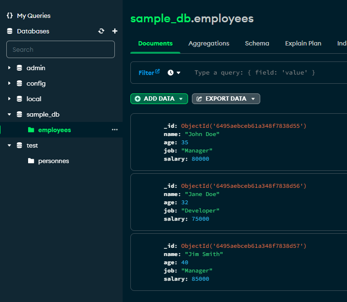
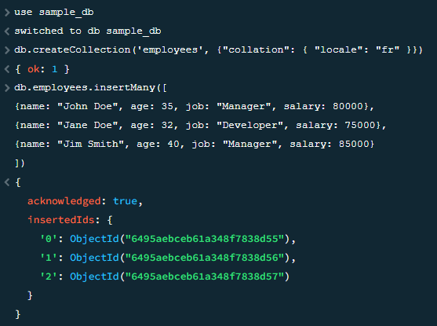

### Question n°2 - Écrivez une requête MongoDB pour trouver tous les documents dans la collection "employees".
#### Requête
````js 
db.employees.find()
````
#### Résultat
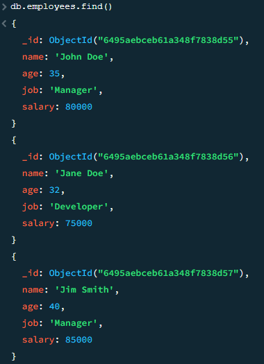

---

### Question n°3 - Écrivez une requête pour trouver tous les documents où l'âge est supérieur à 33.
#### Requête
````js 
db.employees.find({"age": {$gt: 33}})
ou
db.employees.find({$expr: {$gt: ["$age", 33]}})
````
#### Résultat
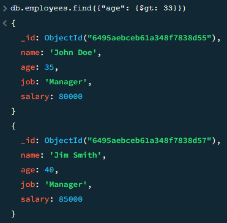
---

### Question n°4 - Écrivez une requête pour trier les documents dans la collection "employees" par salaire décroissant.
#### Requête
````js 
db.employees.aggregate([
    {$sort: { salary: -1 } }
])
````
#### Résultat
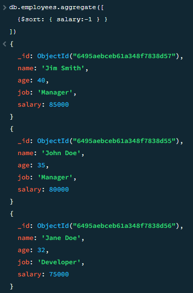

---

#### Question n°5 - Écrivez une requête pour sélectionner uniquement le nom et le job de chaque document.
#### Requête
````js 
db.employees.find({}, {name: true, job: true, _id: false})
````
#### Résultat
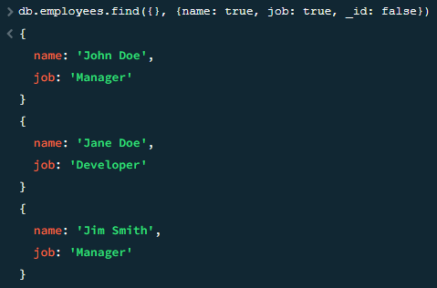

---

#### Question n°6 - Écrivez une requête pour compter le nombre d'employés par poste.
#### Requête
````js 
db.employees.aggregate([{ $group: { _id: "$job", "Number": { $count: {} }}}])
````
#### Résultat
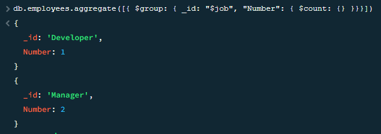
---

#### Question n°7 - Écrivez une requête pour mettre à jour le salaire de tous les développeurs à 80000.
#### Requête
````js 
db.employees.updateMany(
    { "salary": {$ne: 80000}},
    {$set: {"salary": 80000}}
)
````
#### Résultat (Sortie du shell + vue compass) :
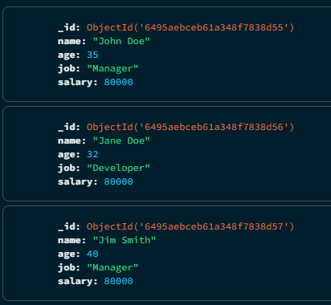
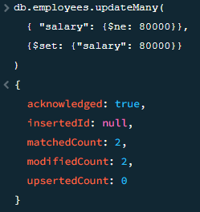

---

# Exercice n° 2
Voici la base de données qui permet d'effectuer la série d'exercices :

```js
db.salles.insertMany([ 
   { 
       "_id": 1, 
       "nom": "AJMI Jazz Club", 
       "adresse": { 
           "numero": 4, 
           "voie": "Rue des Escaliers Sainte-Anne", 
           "codePostal": "84000", 
           "ville": "Avignon", 
           "localisation": { 
               "type": "Point", 
               "coordinates": [43.951616, 4.808657] 
           } 
       }, 
       "styles": ["jazz", "soul", "funk", "blues"], 
       "avis": [{ 
               "date": new Date('2019-11-01'), 
               "note": NumberInt(8) 
           }, 
           { 
               "date": new Date('2019-11-30'), 
               "note": NumberInt(9) 
           } 
       ], 
       "capacite": NumberInt(300), 
       "smac": true 
   }, { 
       "_id": 2, 
       "nom": "Paloma", 
       "adresse": { 
           "numero": 250, 
           "voie": "Chemin de l'Aérodrome", 
           "codePostal": "30000", 
           "ville": "Nîmes", 
           "localisation": { 
               "type": "Point", 
               "coordinates": [43.856430, 4.405415] 
           } 
       }, 
       "avis": [{ 
               "date": new Date('2019-07-06'), 
               "note": NumberInt(10) 
           } 
       ], 
       "capacite": NumberInt(4000), 
       "smac": true 
   }, 
    { 
       "_id": 3, 
       "nom": "Sonograf", 
       "adresse": { 
           "voie": "D901", 
           "codePostal": "84250", 
           "ville": "Le Thor", 
           "localisation": { 
               "type": "Point", 
               "coordinates": [43.923005, 5.020077] 
           } 
       }, 
       "capacite": NumberInt(200), 
       "styles": ["blues", "rock"] 
   } 
]) 
```

### Exercice n°1
Affichez l’identifiant et le nom des salles qui sont des SMAC.
#### Requête
````js 
db.salles.find(
    {"smac": {$exists: 1}},
    {"nom": true}
)
````
#### Résultat
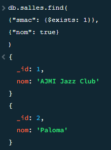

---

### Exercice n°2

Affichez le nom des salles qui possèdent une capacité d’accueil strictement supérieure à 1000 places.
#### Requête
````js 
db.salles.find(
    {"capacite": {$gt : 1000}},
    {"_id" : 0, "nom" : 1}
)
````
#### Résultat
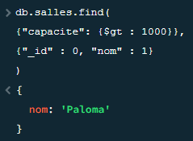

---

### Exercice n°3

Affichez l’identifiant des salles pour lesquelles le champ adresse ne comporte pas de numéro.
````js 
db.salles.find(
    {"adresse.numero" : {$exists : 0}},
    {nom : 0, adresse : 0, avis : 0, capacite : 0, styles: 0}
)
````
#### Résultat
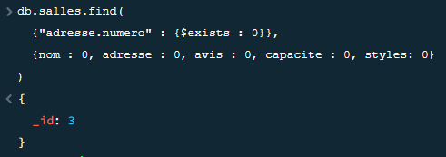

---
### Exercice n°4

Affichez l’identifiant puis le nom des salles qui ont exactement un avis.
````js 
db.salles.find(
    {"avis":{"$size": 1}},
    {"adresse" : 0, "avis" : 0, "capacite" : 0, "smac" : 0}
)
````
#### Résultat
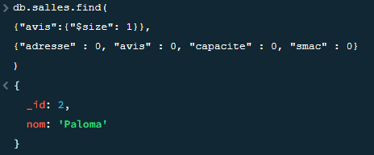

---
### Exercice n°5

Affichez tous les styles musicaux des salles qui programment notamment du blues.
````js 
db.salles.find( 
    {styles: { $all: ["blues"] }},
    {_id : 0, nom : 0, adresse : 0, avis : 0, capacite : 0, smac : 0}
)

ou

db.salles.find(
    {styles : {$in: ["blues"]}},
    {_id : 0, nom : 0, adresse : 0, capacite : 0, avis : 0, smac : 0}
)
````
#### Résultat
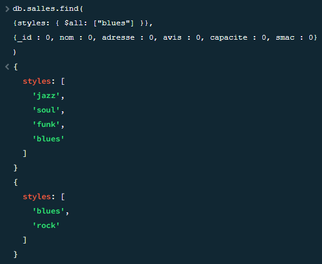

---
### Exercice n°6

Affichez tous les styles musicaux des salles qui ont le style « blues » en première position dans leur tableau styles.
````js 
db.salles.find(
  {"styles.0" : {$in: ["blues"]}},
  {_id : 0, adresse : 0, capacite : 0, avis : 0, smac : 0}
)
````
#### Résultat
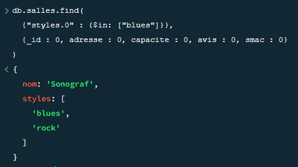

---
### Exercice n°7

Affichez la ville des salles dont le code postal commence par 84 et qui ont une capacité strictement inférieure à 500 places (pensez à utiliser une expression régulière).
````js 
db.salles.find(
    { $and: [
        { "adresse.codePostal" : { $regex : /84*/ } },
        { "capacite": {$lt : 500}}
    ]},
    {"adresse.voie" : 0, "adresse.codePostal" : 0, "adresse.localisation" : 0, "adresse.numero" : 0, capacite : 0, styles : 0, smac : 0, avis : 0, _id : 0, nom : 0}
)
````
#### Résultat
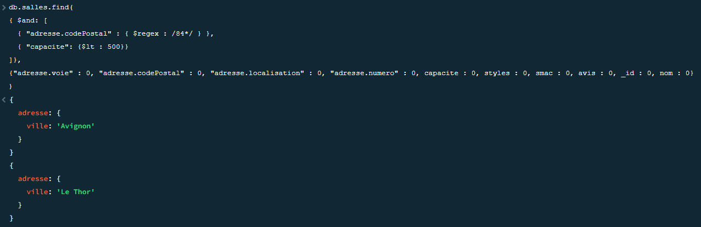
---
### Exercice n°8

Affichez l’identifiant pour les salles dont l’identifiant est pair ou le champ avis est absent.
````js 
db.salles.find(
  {$or: [
    {"_id": {$mod : [2,0]}},
    {"avis": {$exists : 0}}
  ]},
  {nom : 0, adresse : 0, avis : 0, capacite : 0, smac : 0, styles : 0}
)
````
#### Résultat
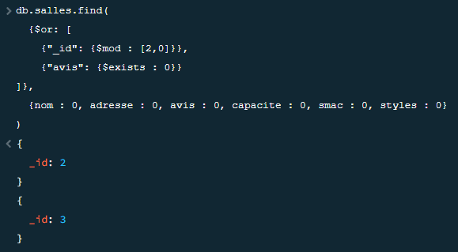

---
### Exercice n°9

Affichez le nom des salles dont au moins un des avis comporte une note comprise entre 8 et 10 (tous deux inclus).
````js 
db.salles.find(
    {"avis.note": {$gte: 8, $lte: 10}},
    {_id : 0, adresse : 0, styles : 0, avis : 0, capacite : 0, smac : 0}
)
````
#### Résultat
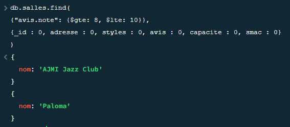

---
### Exercice n°10

Affichez le nom des salles dont au moins un des avis comporte une date postérieure au 15/11/2019 (pensez à utiliser le type JavaScript Date).
````js 
db.salles.find(
    {"avis.date": {$gt : ISODate("2019-11-15")}},
    {_id : 0, adresse : 0, styles : 0, avis : 0, capacite : 0, smac : 0}
)
````
#### Résultat
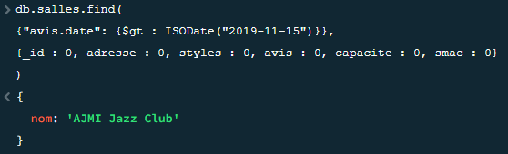

---
### Exercice n°11

Affichez le nom ainsi que la capacité des salles dont le produit de la valeur de l’identifiant par 100 est strictement supérieur à la capacité.
````js 
db.salles.aggregate( [
    { $match:  {  $expr: { $gt: [ { $multiply : [ "$_id", 100 ]}, "$capacite" ] } } },
    { $project : {_id: 0, nom: 1, capacite: 1}}
] )
````

#### Résultat
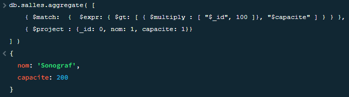

---
### Exercice n°12

Affichez le nom des salles de type SMAC programmant plus de deux styles de musiques différents en utilisant l’opérateur $where qui permet de faire usage de JavaScript.
````js 

````
#### Résultat


---
### Exercice n°13

Affichez les différents codes postaux présents dans les documents de la collection salles.
````js 

````
#### Résultat


---
### Exercice n°14

Mettez à jour tous les documents de la collection salles en rajoutant 100 personnes à leur capacité actuelle.
````js 

````
#### Résultat


---
### Exercice n°15

Ajoutez le style « jazz » à toutes les salles qui n’en programment pas.
````js 

````
#### Résultat


---
### Exercice n°16

Retirez le style «funk» à toutes les salles dont l’identifiant n’est égal ni à 2, ni à 3.
````js 

````
#### Résultat


---
### Exercice n°17

Ajoutez un tableau composé des styles «techno» et « reggae » à la salle dont l’identifiant est 3.
````js 

````
#### Résultat


---
### Exercice n°18

Pour les salles dont le nom commence par la lettre P (majuscule ou minuscule), augmentez la capacité de 150 places et rajoutez un champ de type tableau nommé contact dans lequel se trouvera un document comportant un champ nommé telephone dont la valeur sera « 04 11 94 00 10 ».
````js 

````
#### Résultat


---
### Exercice n°19

Pour les salles dont le nom commence par une voyelle (peu importe la casse, là aussi), rajoutez dans le tableau avis un document composé du champ date valant la date courante et du champ note valant 10 (double ou entier). L’expression régulière pour chercher une chaîne de caractères débutant par une voyelle suivie de n’importe quoi d’autre est [^aeiou]+$.
````js 

````
#### Résultat


---
### Exercice n°20

En mode upsert, vous mettrez à jour tous les documents dont le nom commence par un z ou un Z en leur affectant comme nom « Pub Z », comme valeur du champ capacite 50 personnes (type entier et non décimal) et en positionnant le champ booléen smac à la valeur « false ».
````js 

````
#### Résultat


---
### Exercice n°21

Affichez le décompte des documents pour lesquels le champ _id est de type « objectId ».
````js 

````
#### Résultat


---
### Exercice n°22

Pour les documents dont le champ _id n’est pas de type « objectId », affichez le nom de la salle ayant la plus grande capacité. Pour y parvenir, vous effectuerez un tri dans l’ordre qui convient tout en limitant le nombre de documents affichés pour ne retourner que celui qui comporte la capacité maximale.
````js 

````
#### Résultat


---
### Exercice n°23

Remplacez, sur la base de la valeur de son champ _id, le document créé à l’exercice 20 par un document contenant seulement le nom préexistant et la capacité, que vous monterez à 60 personnes.
````js 

````
#### Résultat


---
### Exercice n°24

Effectuez la suppression d’un seul document avec les critères suivants : le champ _id est de type « objectId » et la capacité de la salle est inférieure ou égale à 60 personnes.
````js 

````
#### Résultat


---
### Exercice n°25

À l’aide de la méthode permettant de trouver un seul document et de le mettre à jour en même temps, réduisez de 15 personnes la capacité de la salle située à Nîmes.
````js 

````
#### Résultat


---